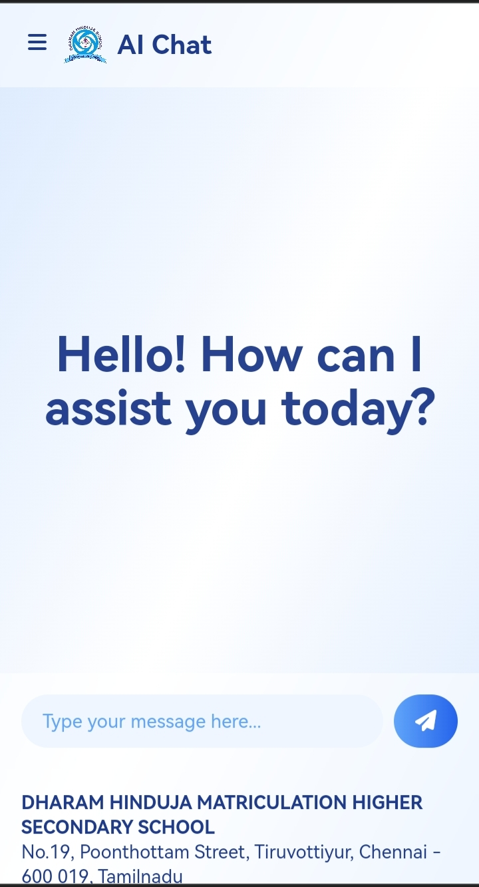
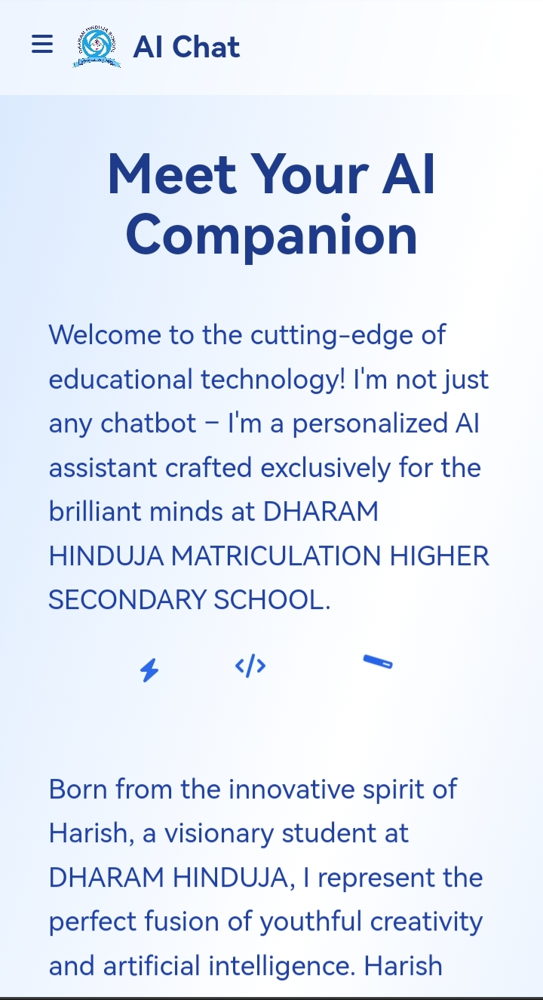

<div align="center">

# 🌟 AI Chat Interface 🌟


### Empowering Minds at Dharam Hinduja School

[](https://github.com/Awesome-Prince)
[](https://github.com/Awesome-Prince/DHS-Chatbot.github.io)
[](https://dharamhindujaschool.org)

</div>

## 🚀 Features

- **💬 Intelligent Conversational AI**: Engage in thought-provoking discussions with our AI assistant.
- **🎨 Sleek, Animated UI**: Enjoy a visually stunning interface with smooth animations.
- **📱 Fully Responsive**: Seamless experience across all devices - desktop, tablet, and mobile.
- **🔍 Multi-Section Navigation**: Easily switch between Home, About, and Contact sections.
- **🔒 User-Friendly Reporting**: Built-in system for reporting issues or inappropriate content.
- **📋 One-Click Copying**: Instantly copy AI responses to your clipboard.
- **🔄 Response Regeneration**: Not satisfied? Regenerate AI responses with a single click.

## 🛠️ Technologies

This project leverages a powerful stack of modern web technologies:

- **HTML5** & **CSS3**: For structure and styling
- **JavaScript (ES6+)**: For dynamic interactivity
- **Tailwind CSS**: For rapid, utility-first styling
- **Font Awesome**: For sleek, scalable icons
- **Axios**: For efficient HTTP requests
- **Toastify**: For stylish notifications

## 💻 Usage

1. **Chat Interface**: Simply type your question or prompt in the input field and hit send.
2. **Navigation**: Use the menu button (top-left) to switch between different sections.
3. **Reporting**: Found an issue? Use the flag icon to report problematic content.
4. **Copy & Regenerate**: Easily copy or regenerate AI responses using the provided buttons.

## 📸 Screenshots


*AI Chat in action*


*Learn about your AI companion*

## 🌈 Customization

The interface uses a soothing blue color scheme by default, but it's highly customizable. Adjust the color variables in the CSS to match your school's branding:

```css
:root {
  --primary-color: #3b82f6;
  --secondary-color: #60a5fa;
  --background-color: #eff6ff;
  --text-color: #1e40af;
}
```

## 🚀 Future Enhancements

- **Voice Interaction**: Implement speech recognition for voice-based queries.
- **Personalized Learning Paths**: AI-driven customized learning experiences.
- **Multilingual Support**: Extend the AI's capabilities to multiple languages.
- **Interactive Tutorials**: Guided walkthroughs for complex topics.

## 👨‍💻 About the Developer

This innovative project was brought to life by **Harish**, a visionary student at Dharam Hinduja Matriculation Higher Secondary School. Harish's passion for technology and education shines through in every aspect of this AI Chat Interface.

## 📞 Contact

For any queries or feedback, please reach out:

- **Email**: dharam_hinduja@yahoo.com
- **Phone**: (044) 2572-7553, +91 9025218724
- **Address**: No.19, Poonthottam Street, Tiruvottiyur, Chennai - 600 019, Tamilnadu

---

<p align="center">
  Made with ❤️ by Harish for Dharam Hinduja Matriculation Higher Secondary School
</p>

<p align="center">
  
</p>
